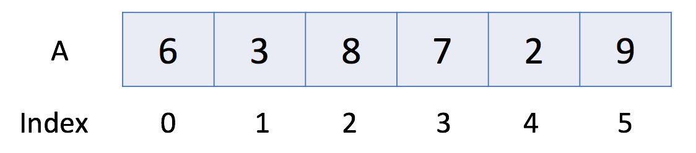

# Array and String

## Introduction

Array is one of the fundamental blocks in data structure. Since a string is just formed by an array of characters, they are both similar. Most interview questions fall into this category.

In this card, we will introduce array and string. After finishing this card, you should:

1. Understand the differences between array and dynamic array;
2. Be familiar with basic operations in the array and dynamic array;
3. Understand multidimensional arrays and be able to use a two-dimensional array;
4. Understand the concept of string and the different features string has;
5. Be able to apply the two-pointer technique to practical problems.

# Introduction to Arrays

## [Introduction to Arrays](https://leetcode.com/explore/learn/card/array-and-string/201/introduction-to-array/1143/)

An array is a basic data structure to **store a collection of elements sequentially**. But elements can be **accessed randomly** since each element in the array can be identified by an array index.

An array can have one or more dimensions. Here we start with the one-dimensional array, which is also called the linear array. Here is an example:



In the above example, there are 6 elements in array A. That is to say, the length of A is 6. We can use A[0] to represent the first element in the array. Therefore, A[0] = 6. Similarly, A[1] = 3, A[2] = 8 and so on.

## [Introduction to Dynamic Array](https://leetcode.com/explore/learn/card/array-and-string/201/introduction-to-array/1146/)

As we mentioned in the previous article, an array has `a fixed capacity` and we need to specify the size of the array when we initialize it. Sometimes this will be somewhat inconvenient and wasteful.

Therefore, most programming languages offer built-in `dynamic array` which is still a random access list data structure but with `variable size`. For example, we have vector in C++ and ArrayList in Java.

## [Find Pivot Index](https://leetcode.com/explore/learn/card/array-and-string/201/introduction-to-array/1144/)

Given an array of integers `nums`, calculate the **pivot index** of this array.

The **pivot index** is the index where the sum of all the numbers **strictly** to the left of the index is equal to the sum of all the numbers **strictly** to the index's right.

If the index is on the left edge of the array, then the left sum is 0 because there are no elements to the left. This also applies to the right edge of the array.

Return the **leftmost pivot index**. If no such index exists, return -1.

### Example 1:

```
Input: nums = [1,7,3,6,5,6]
Output: 3
Explanation:
The pivot index is 3.
Left sum = nums[0] + nums[1] + nums[2] = 1 + 7 + 3 = 11
Right sum = nums[4] + nums[5] = 5 + 6 = 11
```

### Example 2:

```
Input: nums = [1,2,3]
Output: -1
Explanation:
There is no index that satisfies the conditions in the problem statement.
```

Example 3:

```
Input: nums = [2,1,-1]
Output: 0
Explanation:
The pivot index is 0.
Left sum = 0 (no elements to the left of index 0)
Right sum = nums[1] + nums[2] = 1 + -1 = 0
```
